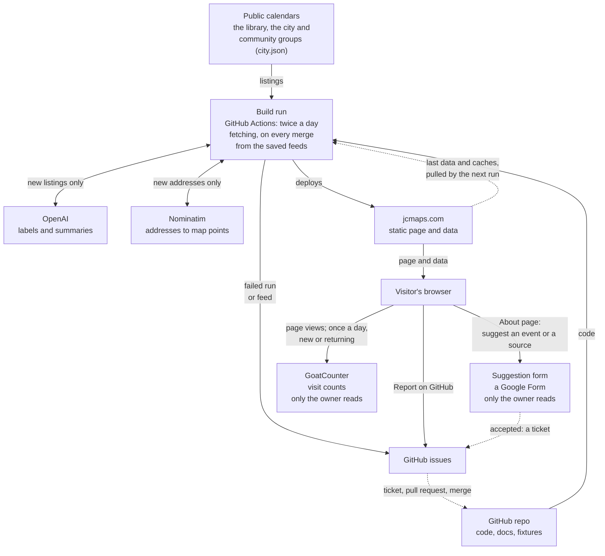
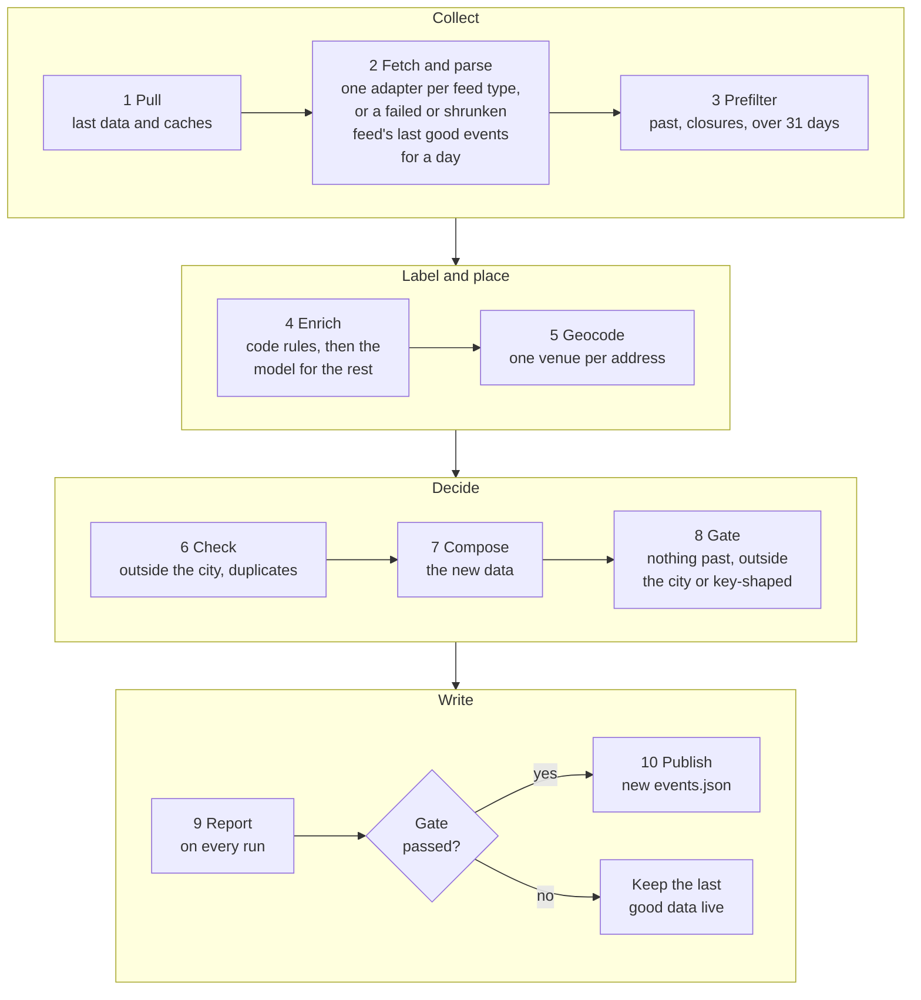

# How it works

JCMaps shows Jersey City events on a map, by time window. It has no server and no database: twice a day a GitHub
Actions run rebuilds the data from public feeds and publishes a static site, and the next run starts from what the
live site holds. [routine.md](routine.md) says who does what, and when.

## The big picture

- **Code reads the feeds.** The model only labels and summarizes events that code found; it never adds one. A feed's
  email addresses and phone numbers become placeholders as it is read, so neither the cache, the fixtures nor the
  model hold them.
- **Where things live:** code, docs and fixtures in git; the current data and caches on the live site; run reports
  and model logs as run artifacts for 90 days. The only secret is `OPENAI_API_KEY`.

## One build

- **Evidence or unknown.** A model answer is kept only if it quotes the listing; otherwise the field says unknown.
  Answers are cached by the listing's text, so only new listings cost a call.
- **The gate** refuses new data with past events, pins outside the city, no events at all, or anything shaped like a
  key. The site then keeps the last good data, and an issue opens.
- **A feed that cannot be reached, or that lists far fewer events than the source published last time,** keeps its
  last good events, from the pulled data, for a day after its last successful fetch. They go through the same checks
  and gate, and a fresh listing of the same event wins. After a day, a feed that cannot be reached is left out,
  without failing the gate, until it answers again, and a feed that shrank is published as it is. Either way an
  issue opens.

## The page

Pick a time window (today, the default; tomorrow, weekend or dates), Family or Everyone, and Free. Each pin shows
what kind of event is on and how many, and the list shows the events in view. Family hides only events marked not
for kids; unknowns show with a label. Free shows only events that say they are free, and the list says how many it
left out for not listing a price. Data more than a day old shows a banner. "About JC Maps", in the map's credits and
at the end of the list, opens the About page: who makes JC Maps, where the events come from, and a form for
suggesting more. GoatCounter counts page views without cookies, and once a day whether the browser has been here
before, from the date of its last visit, which only the browser keeps.

## Where the code is

| Part | Files |
|---|---|
| The run | `.github/workflows/build.yml` runs `pipeline/cli.py`, which calls the stages in order; `.github/workflows/test.yml` runs the tests on a pull request |
| Collect | `pipeline/sources/library.py` (library iCal), `pipeline/sources/ical.py` (any other iCal feed, such as the city's), `pipeline/sources/tribe.py` (sites on The Events Calendar), `pipeline/sources/njdoh.py` (the state health calendar's CSV), `pipeline/check.py` (prefilter) |
| Label and place | `pipeline/enrich.py` (rules, event types), `pipeline/llm.py` (the one model call), `pipeline/geocode.py` |
| Decide and write | `pipeline/check.py` (city boundary, duplicates), `pipeline/gate.py`, `pipeline/publish.py` |
| The page | `site/index.html`, `site/app.js`, `site/search.js` (filter rules), `site/icons.js`, `site/about.html` (the About page), `site/visits.js` (visit counts), `site/tokens.css` (colors and shapes, for both pages); the look is in `docs/design.md` |
| Settings | `city.json` (sources, city boundary), `data/library_branches.json`, `data/venue_points.json` (known map points, never geocoded) |

When a pull request changes one of these flows, it updates the diagram too (AGENTS.md).
