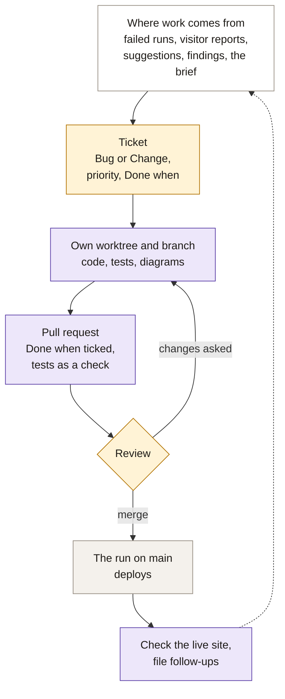

# Routine

What runs by itself, what a person does, and how a change reaches the site. [how-it-works.md](how-it-works.md)
explains the parts.

## Maintenance

The first two rows run by themselves; the rest is the owner's.

| When | What |
|---|---|
| Twice a day (about 2am and 7am) | The run fetches every feed, rebuilds and redeploys the site. A failed run keeps the last good data live and opens an `auto:build` issue. So does a feed that cannot be reached or that lists far fewer events than before, whose last good events stay for a day while the other sources update. |
| On every merge | The same run from the feeds the last scheduled run saved: no request reaches a source, and the change is live within minutes. |
| Daily, 1 minute | Check that jcmaps.com's footer says *Updated* today and that no issue is new. |
| An `auto:build` issue opens | Read it and the run log. If a feed was only down, the next run fetches it again (re-run the workflow to hurry it); otherwise open a Bug ticket. Fix it within a day: after that, visitors see the stale-data banner, or a feed that is still down drops off the site. |
| A visitor report opens (*Wrong listing: …*) | Compare the event with its source. If our data is wrong, open a Bug ticket. A wrong pin is fixed by adding the venue's point to `data/venue_points.json`. |
| A suggestion arrives in the Google Form | Read it within a week. A source with a public calendar becomes a Change ticket. Until the map can take approved events, point an organizer to a calendar the map reads, such as the Office of Cultural Affairs' community calendar. Reply if they left an email. Their email stays in the form's responses, never in the repo. |
| Weekly, 10 minutes | Read [the run report](https://jcmaps.com/data/report.json): events per source, drops, venues without a pin, cost. On GoatCounter, look at the week's new and returning visitors and the sites that sent them. Until 24 October 2026, also compare the Weekend list with JC Families and Macaroni KID. |
| Monthly | Check OpenAI spend against the budget. |
| At least every 60 days | Make a commit. GitHub switches off a public repo's schedule after 60 quiet days; turn it back on under Actions. |
| Rarely | Rotate the OpenAI key if it may have leaked (README). Renew the domain by 24 September 2028. |

## Development

Yellow is the owner, who reviews, merges and is responsible for every change; violet is an agent; grey runs by
itself.

1. **Ticket.** Use the Bug or Change template; *Done when* lists checkable statements. One ticket per pull request.
   *Priority* says how soon: **high** for a broken or stale site, **medium** for wrong data or a fix that prevents a
   class of errors, **low** for new features and polish. Next up: the highest priority, oldest first.
2. **Branch.** Each ticket gets its own worktree from `origin/main`. Several sessions share the main folder, so
   never switch branches there.
3. **Change.** Code with tests. A new source is a module in `pipeline/sources/`, fixtures and a `city.json` entry.
   A prompt or model change is scored on `fixtures/labeled/enrich.json` first (no command does that yet). A changed
   flow means an updated diagram.
4. **Check.** `uv run pytest`; for data, `uv run jcmaps build --pull`; for the page, `python -m http.server -d site`.
5. **Pull request.** Tick *Done when*, saying how each was checked; the tests run on it as a check. The person
   committing is the author.
6. **After the merge.** Confirm the run is green and the site shows the change. Record predicted numbers in
   `docs/numbers.md`, file anything you found as new tickets, and remove the worktree.
