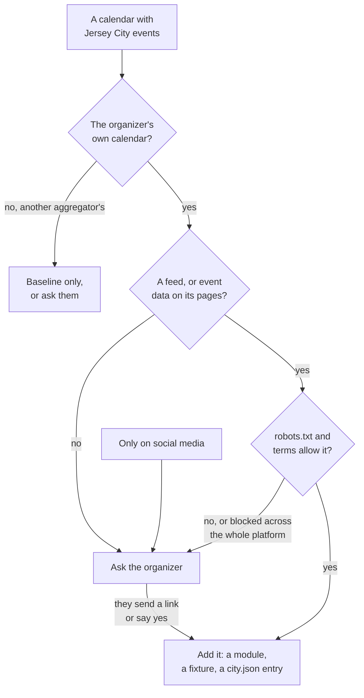

# Sources

How JC Maps finds and reads event calendars. The rules are the ones reputable aggregators follow (Google's event
listings, CitySpark, Calagator, City Bureau's City Scrapers), plus what a sweep of about 120 Jersey City sources
taught us on 2026-09-24.

## How a calendar gets in

## Rules

**Where we look**

1. **The organizer first.** We read the organizer's own calendar, not another aggregator's choice of events
   (JC Families, Macaroni KID, Patch, The Local Girl). Aggregators are baselines we compare against by hand.
2. **Feed first.** An iCal, RSS or JSON feed; then the event data (schema.org) on the event's own page; then a
   stable page. Code parses all of them.
3. **robots.txt and the terms decide.** Where they say no, or a site blocks scripts, we ask the organizer. We never
   work around a block: no disguised browser, no login, no CAPTCHA, no paywall.
4. **A block across a whole platform counts as no.** Google Calendar and Squarespace disallow every calendar's
   feed, so we read one only when its organizer gives us the link.
5. **No social media.** Facebook, Instagram, X, Nextdoor and Reddit forbid collection or charge for it. We invite
   those organizers to share a calendar, and v2 takes flyers.

**How we visit**

6. **On the schedule, at the site's pace.** Only scheduled and manual runs fetch: one request at a time, spaced as
   robots.txt asks, under the name JCMaps with a link to jcmaps.com. Until #42 lands, merges fetch too, unspaced.

**What we keep**

7. **Facts, a link and our own words.** Title, time, place, price and audience, a link to the event's page, and a
   short summary we write. Never copied descriptions or images.
8. **Fresh on every fetch.** Each fetching run re-reads every source, so changes and cancellations show by the next
   scheduled run. When two sources disagree, the organizer's own listing wins.
9. **No personal data.** Details about people that a feed carries beyond its public listing (submitters, staff
   contacts, attendees) and meeting links with passcodes are dropped when the feed is read: email addresses and
   phone numbers become placeholders before the cache, the fixtures or the model see the feed. The map shows none,
   since the event's link carries the contact.
10. **Organizers stay in charge.** Every event links to its source, and an organizer can have a listing fixed or
    removed through the report link or the About page.

## Never on the map

- Support and recovery meetings (AA, NA, Gamblers Anonymous and the like).
- Events at private homes.
- School events a school has not made public. Schools opt in with a public-only calendar: shows, fairs, public
  meetings and home games, at a street address, never a room, with no names but performers'.

## Still open

- **AI-use signals.** Some sites ask not to have their text fed to AI (`Content-Signal: ai-input=no` in robots.txt,
  or blocks on AI agents). The Office of Cultural Affairs blocks AI crawlers; we keep summarizing its events for
  now, and change course if it objects.

## Projects like ours

| Project | What it does | What we take from it |
|---|---|---|
| [City Scrapers](https://www.citybureau.org/city-scrapers), City Bureau, Chicago | Collects public meetings from local government sites, one scraper per agency, open source. It feeds the Documenters, residents paid to attend and report. | One module per source, frozen test pages, public meetings as events |
| [Calagator](https://calagator.org/), Portland | A community tech calendar anyone can add to; imports iCal | Organizers add their own events (our v2) |
| [Gancio](https://gancio.org/) | Shared agendas for local communities: moderated, anonymous posting allowed, every agenda also out as RSS, iCal and ActivityPub | Give the data back as open feeds |
| [Mobilizon](https://joinmobilizon.org/) | Federated events and groups, a free alternative to Facebook events; maintained by Kaihuri since 2024 | A place a social-only group could post instead |
| [OpenActive](https://www.openactive.io/), England | An open data standard for activity sessions (what, where, when, price), led by Sport England and the ODI, with no personal data | Publish in a standard others can reuse |
